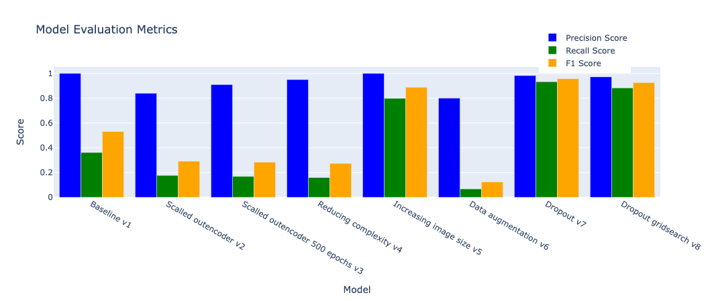

# Screw Anomaly Detection using Autoencoders

This project is the second submission for the course [IE 694 - Industrial Applications of Artificial Intelligence](https://www.uni-mannheim.de/dws/teaching/course-details/courses-for-master-candidates/ie-694-industrial-applications-of-artificial-intelligence/) at the University of Mannheim.

## Table of Contents
- [Introduction](#introduction)
- [Dataset](#dataset)
- [Model](#model)
- [Results](#results)
- [Conclusion](#conclusion)
- [References](#references)

## Introduction <a id="introduction"></a>

In this project, we focus on identifying and distinguishing between defective and non-defective screws using a series of images. We aim to leverage the power of machine learning models, specifically autoencoders, to accurately flag defective screws in the test set. This automated detection system is designed to enhance the efficiency of the quality control process in manufacturing.

## Dataset <a id="dataset"></a>

The dataset used in this project was sourced from Kaggle and can be found [here](https://www.kaggle.com/datasets/thomasdubail/screwanomalies-detection). It consists of images of screws, both defective and non-defective, which are used to train and test the autoencoder models.

## Model <a id="model"></a>

The project is designed with two main objectives:

1. **Construct a Base Autoencoder Model:** The initial model serves as our reference point for evaluating the effectiveness of various architectural tweaks and enhancements implemented in subsequent models. The focus at this stage is not on the sophistication and performance of this base model, but rather on establishing a solid groundwork for future experimentation and comparison.

2. **Experimentation and Architectural Diversification:** We plan to design, train, and evaluate a range of autoencoder models with differing structures and complexities. This involves exploring various image sizes and experimenting with straightforward data augmentation techniques. Our end goal is to identify the models that demonstrate the best performance and use them to build a robust, efficient, and precise defect detection system for screws.

## Results <a id="results"></a>



After an extensive period of experimentation, as shown in the provided graph, we found that the factor with the most significant impact on improving performance was the increase in image size. Although various architectural adjustments and modifications to our model contributed to the overall performance, the dominant factor was undoubtedly the image size.

The influence of image size is profound because larger images contain more detailed information, which could provide the model with richer and more intricate patterns to learn from. As a result, the model becomes better equipped to identify defective screws accurately, which directly leads to improved performance.

As for our architectural tweaks, even though they weren't the most substantial contributing factor, they still played an essential role in fine-tuning our model. These changes, coupled with increasing the image size, collectively led to our final model outperforming our initial benchmark. We were able to improve the F1 score from 0.53 at the beginning of our experiments to a high of nearly 0.96, demonstrating significant progress and validating our approach.

## Conclusion <a id="conclusion"></a>

Through the course of this study, we have explored the process of developing and refining autoencoder models for the task of screw anomaly detection. This challenging yet exciting journey has not only presented us with a deeper understanding of autoencoders but also unveiled the potential of these machine learning models in effectively addressing real-world problems, especially in scenarios where data is limited.

Our key takeaways from this study are twofold. Firstly, we've observed that the image size significantly influences the performance of autoencoder models.```markdown
Larger images inherently carry more detailed information, providing our model with a rich and nuanced understanding of the patterns to learn from. This finding has sparked an interest in further exploration and experimenting with larger image sizes, which could be a valuable area for future research, provided that computational resources are not a limiting factor.

Secondly, our experiments highlighted the relevance of continual architectural improvements and adjustments in enhancing model performance. Although these adjustments didn't dominate the performance improvement as much as image size did, they were instrumental in tuning the model to its highest performance and further underline the necessity for architectural experimentation in model development.

Working with limited computational resources, specifically on a laptop, was a constraint in our study but it also showcased the feasibility of conducting meaningful machine learning research without an extensive hardware setup. It would have been beneficial to have more computational power, especially for potentially exploring larger image sizes or conducting exhaustive model searches like grid search.

The practicality of autoencoders in this context, especially given limited data availability, has left us intrigued about their potential applications in various other domains. Autoencoders are a powerful tool in the machine learning toolkit and this project has served to further reinforce their relevance and applicability.

In conclusion, this study was not only a rewarding learning journey but also a successful venture in improving screw anomaly detection using autoencoders. We look forward to leveraging these findings in future projects and further exploring the potential of autoencoders in machine learning.

## References <a id="references"></a>

- [IE 694 - Industrial Applications of Artificial Intelligence](https://www.uni-mannheim.de/dws/teaching/course-details/courses-for-master-candidates/ie-694-industrial-applications-of-artificial-intelligence/)
- [Screw Anomalies Detection Dataset](https://www.kaggle.com/datasets/thomasdubail/screwanomalies-detection)
